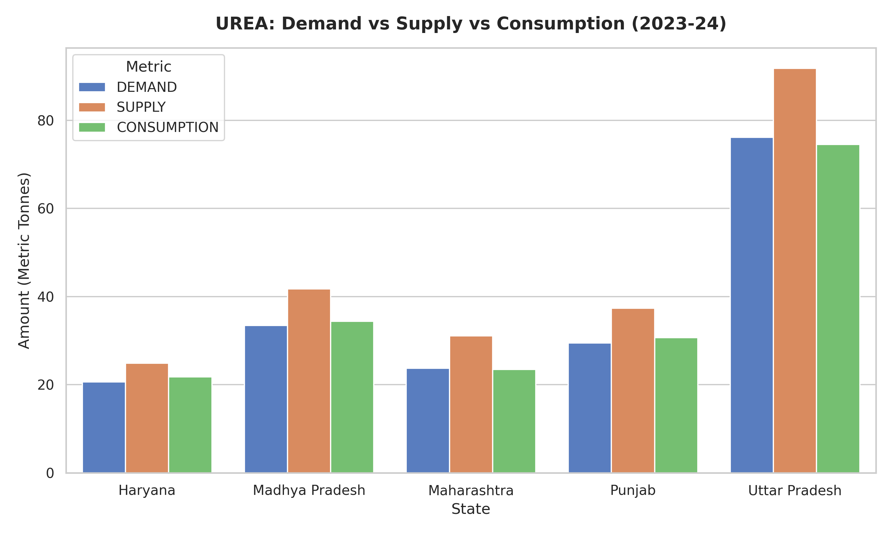

# Demand Forecasting in Macro-Level Agricultural Supply Chains

This repository contains the structured data engineering pipeline and multivariate regression models developed for the course *Fundamentals of AI using Agriculture Data Set* under the ANNAM.AI Centre of Excellence, Ministry of Education, Government of India, at IIT Ropar.

## 📊 Algorithmic Metrics & Evaluation
* **Deployed Regressor:** Random Forest Ensemble Model
* **R-squared ($R^2$) Score:** 0.9949 (99.49% variance captured)
* **Mean Squared Error (MSE):** 5.5019

### Systemic Over-Allocation Analysis (EDA Insight)
Our initial exploratory data metrics uncovered a consistent historical trend where the supplied metrics for highly subsidized UREA consistently overshot both real consumption and actual stated demand.

### Machine Learning Feature Weights
Evaluating the algorithm's internal logic via feature importance extraction proves that macro-level fertilizer demand across Indian states is highly inelastic year-over-year, relying heavily on the engineered historical consumption lag ($t-1$) feature.

